<div align="center">

# 🧬 DECIMER.ai

### Deep Learning for Chemical Image Recognition


**Transform chemical structure images into machine-readable formats with state-of-the-art AI**

---

[](https://opensource.org/licenses/MIT)
[](https://GitHub.com/Steinbeck-Lab/DECIMER.ai/graphs/commit-activity)
[](https://GitHub.com/Steinbeck-Lab/DECIMER.ai/issues/)
[](https://GitHub.com/Steinbeck-Lab/DECIMER.ai/graphs/contributors/)

[](https://GitHub.com/Steinbeck-Lab/DECIMER.ai/releases/)
[](https://zenodo.org/badge/latestdoi/486488537)
[](https://www.tensorflow.org)

[🌐 Live Demo](https://decimer.ai) | [📖 Documentation](https://github.com/Steinbeck-Lab/DECIMER.ai/wiki) | [💬 Discussions](https://github.com/Steinbeck-Lab/DECIMER.ai/discussions)

</div>

---

## 🌟 What is DECIMER?

DECIMER (Deep lEarning for Chemical IMagE Recognition) is an open-source platform that revolutionizes how we extract chemical information from scientific literature. Powered by cutting-edge deep learning, it automatically identifies, segments, and recognizes chemical structures in images and PDF documents.

### ✨ Key Features

<table>
<tr>
<td width="50%">

#### 🔍 **Intelligent Segmentation**
Automatically detect and extract chemical structures from scientific documents with pixel-perfect precision

</td>
<td width="50%">

#### 🧠 **Neural Recognition**
Convert chemical structure depictions to SMILES using transformer-based deep learning

</td>
</tr>
<tr>
<td width="50%">

#### 📝 **IUPAC Translation**
Generate systematic chemical names from structure depictions with STOUT integration

</td>
<td width="50%">

#### 🎯 **Classification**
Distinguish chemical structures from non-chemical images with high accuracy

</td>
</tr>
</table>

### 🎯 Perfect For

- 📚 **Researchers** extracting data from literature
- 🔬 **Chemists** digitizing hand-drawn structures
- 🏭 **Industry** automating chemical data workflows
- 🎓 **Educators** creating digital chemistry resources

---

## 🚀 Quick Start

### Prerequisites

- 🐳 Docker Desktop (recommended)
- 💻 8GB+ RAM
- 🔧 Git

### Installation by Platform

<details open>
<summary><b>🐧 Linux</b></summary>

```bash
# Clone the repository
git clone https://github.com/Steinbeck-Lab/DECIMER.ai
cd DECIMER.ai/

# Build and launch
docker-compose build --no-cache
docker-compose up -d

# Access at http://localhost:80
```

> **⏱️ First Launch:** Models take 5-10 minutes to load. Grab a coffee! ☕

</details>

<details>
<summary><b>🪟 Windows</b></summary>

1. Install [Docker Desktop](https://www.docker.com/products/docker-desktop/)
2. Reduce resources in supervisor.conf as per [wiki guide](https://github.com/Steinbeck-Lab/DECIMER.ai/wiki)
3. **Run `build-windows.bat` as administrator**

```cmd
# Clone the repository
git clone https://github.com/Steinbeck-Lab/DECIMER.ai
cd DECIMER.ai\

# Run the build script as administrator
# Right-click build-windows.bat → "Run as administrator"
# OR from Administrator CMD:
build-windows.bat
```

**Alternative manual approach:**
```cmd
# Open CMD as Administrator
docker-compose -f docker-compose.windows.yml build --no-cache
docker-compose -f docker-compose.windows.yml up -d
```

> **🔄 Rebuilding?** Clean symlinks first:
> ```cmd
> if exist public\storage del /f /q public\storage 2>nul
> ```

> **💡 Pro Tip:** Consider using WSL2 for better performance

</details>

<details>
<summary><b>🍎 macOS (Apple Silicon)</b></summary>

1. Install [Docker Desktop](https://www.docker.com/products/docker-desktop/)
2. Adjust resources in Docker settings

```bash
git clone https://github.com/Steinbeck-Lab/DECIMER.ai
cd DECIMER.ai/

# Build and launch
docker-compose -f docker-compose.m1.yml build --no-cache
docker-compose -f docker-compose.m1.yml up -d
```

</details>

### 🌐 Access Your Instance

1. Open Chrome or a Chromium-based browser
2. Navigate to `http://localhost:80`
3. Generate app key on first run (if prompted)
4. Wait 5-10 minutes for model initialization
5. Start recognizing structures! 🎉

---

## 🏗️ Architecture

```mermaid
graph LR
    A[📄 Input PDF/Image] --> B[🔍 DECIMER Segmentation]
    B --> C[🎯 Structure Detection]
    C --> D[🧠 DECIMER Transformer]
    D --> E[💫 SMILES Output]
    E --> F[📝 STOUT Naming]
    F --> G[✅ Validated Results]
    
    style A fill:#e1f5ff
    style G fill:#d4edda
```

<div align="center">



</div>

---

## 🔧 Powered By

<div align="center">

<table>
<tr>
<td align="center" width="33%">
<br>
<b>DECIMER Segmentation</b><br>
<sub>Chemical structure detection & extraction</sub><br>
<a href="https://github.com/Kohulan/DECIMER-Image-Segmentation">🔗 Repository</a>
</td>
<td align="center" width="33%">
<br>
<b>DECIMER Transformer</b><br>
<sub>Optical chemical structure recognition</sub><br>
<a href="https://github.com/Kohulan/DECIMER-Image_Transformer">🔗 Repository</a>
</td>
<td align="center" width="33%">
<br>
<b>STOUT</b><br>
<sub>SMILES to IUPAC translation</sub><br>
<a href="https://github.com/Kohulan/Smiles-TO-iUpac-Translator">🔗 Repository</a>
</td>
</tr>
</table>

</div>

---

## 📚 Documentation & Support

| Resource | Description |
|----------|-------------|
| 📖 [Wiki](https://github.com/Steinbeck-Lab/DECIMER.ai/wiki) | Complete documentation and guides |
| 💬 [Discussions](https://github.com/Steinbeck-Lab/DECIMER.ai/discussions) | Community Q&A and support |
| 🐛 [Issues](https://github.com/Steinbeck-Lab/DECIMER.ai/issues) | Bug reports and feature requests |
| ✉️ [Contact](mailto:kohulan.rajan@uni-jena.de) | Direct email support |

---

## 📖 Citation

If DECIMER powers your research, please cite our work:

### Primary Citation

```bibtex
@article{rajan2023decimer,
  title     = {DECIMER.ai: An open platform for automated optical chemical 
               structure identification, segmentation and recognition in 
               scientific publications},
  author    = {Rajan, Kohulan and Brinkhaus, Henning Otto and 
               Agea, Maria Inmaculada and Zielesny, Achim and 
               Steinbeck, Christoph},
  journal   = {Nature Communications},
  volume    = {14},
  pages     = {5045},
  year      = {2023},
  publisher = {Nature Publishing Group},
  doi       = {10.1038/s41467-023-40782-0}
}
```

### Related Publications

<details>
<summary>📄 <b>Click to view all publications</b></summary>

```bibtex
@article{rajan2024advancements,
  title   = {Advancements in hand-drawn chemical structure recognition through 
             an enhanced DECIMER architecture},
  author  = {Rajan, Kohulan and Brinkhaus, Henning Otto and 
             Zielesny, Achim and Steinbeck, Christoph},
  journal = {Journal of Cheminformatics},
  volume  = {16},
  pages   = {78},
  year    = {2024},
  doi     = {10.1186/s13321-024-00872-7}
}

@article{rajan2020decimer,
  title   = {DECIMER: towards deep learning for chemical image recognition},
  author  = {Rajan, Kohulan and Zielesny, Achim and Steinbeck, Christoph},
  journal = {Journal of Cheminformatics},
  volume  = {12},
  pages   = {65},
  year    = {2020},
  doi     = {10.1186/s13321-020-00469-w}
}

@article{rajan2021segmentation,
  title   = {DECIMER-Segmentation: Automated extraction of chemical structure 
             depictions from scientific literature},
  author  = {Rajan, Kohulan and Brinkhaus, Henning Otto and 
             Sorokina, Maria and others},
  journal = {Journal of Cheminformatics},
  volume  = {13},
  pages   = {20},
  year    = {2021},
  doi     = {10.1186/s13321-021-00496-1}
}

@article{rajan2021transformer,
  title   = {DECIMER 1.0: deep learning for chemical image recognition 
             using transformers},
  author  = {Rajan, Kohulan and Zielesny, Achim and Steinbeck, Christoph},
  journal = {Journal of Cheminformatics},
  volume  = {13},
  pages   = {61},
  year    = {2021},
  doi     = {10.1186/s13321-021-00538-8}
}

@article{rajan2021stout,
  title   = {STOUT: SMILES to IUPAC names using neural machine translation},
  author  = {Rajan, Kohulan and Zielesny, Achim and Steinbeck, Christoph},
  journal = {Journal of Cheminformatics},
  volume  = {13},
  pages   = {34},
  year    = {2021},
  doi     = {10.1186/s13321-021-00512-4}
}
```

</details>

---

## 🤝 Contributing

We welcome contributions! Here's how you can help:

1. 🍴 Fork the repository
2. 🌿 Create a feature branch (`git checkout -b feature/amazing-feature`)
3. 💾 Commit your changes (`git commit -m 'Add amazing feature'`)
4. 📤 Push to the branch (`git push origin feature/amazing-feature`)
5. 🎉 Open a Pull Request

See our [Contributing Guidelines](CONTRIBUTING.md) for more details.

---

## 📜 License

This project is licensed under the **MIT License** - see the [LICENSE](LICENSE) file for details.

```
MIT License - Free for academic and commercial use
```

---

## 🌐 Community & Research

<div align="center">

### 👥 Developed by the Steinbeck Group

<a href="https://cheminf.uni-jena.de">

</a>

**[Cheminformatics and Computational Metabolomics](https://cheminf.uni-jena.de)**  
Friedrich Schiller University Jena, Germany

---

### 🔗 Connect With Us

[](https://cheminf.uni-jena.de)
[](https://twitter.com/SteinbeckGroup)
[](https://github.com/Steinbeck-Lab)

---

### 🎯 Related Projects

| Project | Description |
|---------|-------------|
| 🌴 [COCONUT](https://coconut.naturalproducts.net) | Natural Products Database |
| 🧪 [STOUT](https://github.com/Kohulan/Smiles-TO-iUpac-Translator) | SMILES to IUPAC Translator |
| 🔬 [DECIMER-Segmentation](https://github.com/Kohulan/DECIMER-Image-Segmentation) | Structure Detection Tool |

</div>

---

<div align="center">

### ⭐ Star History

[](https://star-history.com/#Steinbeck-Lab/DECIMER.ai&Date)

---

**Made with ❤️ and ☕ by the Steinbeck Group**

*Transforming chemical knowledge, one image at a time*

[⬆ Back to Top](#-decimerai)

</div>