<div align="center">

# 🧬 DECIMER.ai

### Deep Learning for Chemical Image Recognition


**Transform chemical structure images into machine-readable SMILES with state-of-the-art AI**

---

[](https://opensource.org/licenses/MIT)
[](https://GitHub.com/Steinbeck-Lab/DECIMER.ai/graphs/commit-activity)
[](https://GitHub.com/Steinbeck-Lab/DECIMER.ai/issues/)
[](https://GitHub.com/Steinbeck-Lab/DECIMER.ai/graphs/contributors/)
[](https://GitHub.com/Steinbeck-Lab/DECIMER.ai/releases/)
[](https://zenodo.org/badge/latestdoi/486488537)
[](https://www.tensorflow.org)

[🚀 Use DECIMER](https://decimer.ai) | [📖 Documentation](https://github.com/Steinbeck-Lab/DECIMER.ai/wiki) | [💬 Discussions](https://github.com/Steinbeck-Lab/DECIMER.ai/discussions) | [📄 Publications](#-citation)

</div>

---

## 🎯 Overview

**DECIMER** (Deep lEarning for Chemical IMagE Recognition) is an open-source, production-ready platform that revolutionizes chemical structure extraction from scientific literature. Powered by cutting-edge transformer-based deep learning, DECIMER automatically identifies, segments, and converts chemical structures into SMILES representations with remarkable accuracy.

<div align="center">

### 🌟 Why DECIMER?

</div>

<table>
<tr>
<td align="center" width="25%">

<h4>🧠 State-of-the-Art AI</h4>
<sub>Transformer architecture trained on millions of structures</sub>
</td>
<td align="center" width="25%">

<h4>⚡ Production Ready</h4>
<sub>Battle-tested on thousands of scientific documents</sub>
</td>
<td align="center" width="25%">

<h4>🔓 Open Source</h4>
<sub>MIT licensed for academic and commercial use</sub>
</td>
<td align="center" width="25%">

<h4>🛠️ Self-Hosted</h4>
<sub>Complete control over your data and infrastructure</sub>
</td>
</tr>
</table>

---

## ✨ Core Capabilities

```mermaid
graph LR
    A[📄 PDF/Images] --> B[🔍 Segmentation]
    B --> C[🎯 Detection]
    C --> D[🧠 Recognition]
    D --> E[✅ SMILES]
    
    style A fill:#e3f2fd,stroke:#1976d2,stroke-width:2px
    style B fill:#fff3e0,stroke:#f57c00,stroke-width:2px
    style C fill:#f3e5f5,stroke:#7b1fa2,stroke-width:2px
    style D fill:#e8f5e9,stroke:#388e3c,stroke-width:2px
    style E fill:#d4edda,stroke:#155724,stroke-width:3px
```

<div align="center">



</div>

### 🔥 Key Features

<table>
<tr>
<td width="50%" valign="top">

#### 📑 **Document Processing**
- **PDF Support**: Extract structures from multi-page documents
- **Image Formats**: PNG, JPEG, WebP, HEIC support
- **Batch Processing**: Handle multiple files simultaneously
- **High Resolution**: Processes images at 300 DPI for optimal accuracy

</td>
<td width="50%" valign="top">

#### 🎨 **Structure Recognition**
- **Printed Structures**: Industry-standard depictions
- **Hand-Drawn**: Recognizes sketched molecules
- **Complex Structures**: Handles stereochemistry and large molecules
- **Markush Detection**: Identifies generic structures

</td>
</tr>
<tr>
<td width="50%" valign="top">

#### 🔍 **Intelligent Segmentation**
- **Automatic Detection**: Finds structures in complex layouts
- **Pixel-Perfect Extraction**: Maintains structure clarity
- **Multi-Structure**: Extracts all structures from a single image
- **Classification**: Distinguishes chemical from non-chemical images

</td>
<td width="50%" valign="top">

#### 🎯 **Output & Validation**
- **SMILES Generation**: Standard chemical notation
- **InChIKey Creation**: Unique molecular identifiers
- **Validation**: Automatic structure verification
- **Interactive Editing**: Built-in Ketcher editor for corrections

</td>
</tr>
</table>

---

## 🚀 Quick Start

### 📋 Prerequisites

| Requirement | Minimum | Recommended |
|------------|---------|-------------|
| 💻 RAM | 8 GB | 16 GB+ |
| 💾 Storage | 10 GB | 20 GB+ |
| 🐳 Docker | Latest | Latest |
| 🌐 Browser | Chrome 90+ | Chrome/Edge Latest |

### ⚡ Installation

<details open>
<summary><b>🐧 Linux / macOS</b></summary>

```bash
# Clone the repository
git clone https://github.com/Steinbeck-Lab/DECIMER.ai
cd DECIMER.ai/

# Build and launch
docker-compose build --no-cache
docker-compose up -d

# Monitor startup (optional)
docker-compose logs -f supervisor
```

**🍎 For Apple Silicon (M1/M2/M3):**
```bash
docker-compose -f docker-compose.m1.yml build --no-cache
docker-compose -f docker-compose.m1.yml up -d
```

</details>

<details>
<summary><b>🪟 Windows</b></summary>

1. **Install** [Docker Desktop](https://www.docker.com/products/docker-desktop/)
2. **Configure** resources in Docker Desktop settings (4+ CPU cores, 8+ GB RAM)
3. **Run as Administrator:**

```cmd
git clone https://github.com/Steinbeck-Lab/DECIMER.ai
cd DECIMER.ai\

# Run the automated build script
build-windows.bat
```

**Alternative manual approach:**
```cmd
docker-compose -f docker-compose.windows.yml build --no-cache
docker-compose -f docker-compose.windows.yml up -d
```

> **💡 Pro Tip:** For better performance, consider using WSL2

</details>

### 🌐 Access Your Instance

1. Open your browser to **`http://localhost:80`**
2. Wait 5-10 minutes for model initialization ⏱️
3. Upload a PDF or image containing chemical structures
4. Download your results as SMILES strings and mol files! 🎉

> **📊 First-Time Setup:** The initial startup loads several large neural network models. Subsequent starts will be much faster.

---

## 🏗️ Architecture

<div align="center">

### System Components

</div>

<table>
<tr>
<td align="center" width="33%">
<br>
<h4>🔍 DECIMER Segmentation</h4>
<sub>Detects and extracts chemical structures from documents using Mask R-CNN</sub><br>
<br>
<a href="https://github.com/Kohulan/DECIMER-Image-Segmentation">📦 Repository</a> • 
<a href="https://doi.org/10.1186/s13321-021-00496-1">📄 Paper</a>
</td>
<td align="center" width="33%">
<br>
<h4>🧠 DECIMER Transformer</h4>
<sub>Converts structure images to SMILES using Vision Transformers</sub><br>
<br>
<a href="https://github.com/Kohulan/DECIMER-Image_Transformer">📦 Repository</a> • 
<a href="https://doi.org/10.1186/s13321-021-00538-8">📄 Paper</a>
</td>
<td align="center" width="33%">
<br>
<h4>🎯 Image Classifier</h4>
<sub>Distinguishes chemical structures from other images with CNNs</sub><br>
<br>
<a href="https://github.com/Steinbeck-Lab/DECIMER-Image-Classifier">📦 Repository</a>
</td>
</tr>
</table>

<div align="center">

### 🔧 Tech Stack

[](https://laravel.com)
[](https://python.org)
[](https://tensorflow.org)
[](https://docker.com)
[](https://rdkit.org)

</div>

---

## 🎯 Use Cases

<table>
<tr>
<td width="50%">

### 📚 **Academic Research**
- Literature data mining
- Chemical database curation
- Systematic reviews
- Patent analysis

</td>
<td width="50%">

### 🏭 **Industry Applications**
- High-throughput screening
- Competitive intelligence
- Legacy data digitization
- Regulatory documentation

</td>
</tr>
<tr>
<td width="50%">

### 🔬 **Chemical Informatics**
- Structure-activity relationships
- Chemical space exploration
- Property prediction pipelines
- Automated annotation

</td>
<td width="50%">

### 🎓 **Education**
- Creating digital resources
- Chemical structure databases
- Interactive learning materials
- Open educational resources

</td>
</tr>
</table>

---

## 📊 Performance

<div align="center">

| Metric | Value | Details |
|--------|-------|---------|
| 🎯 **Accuracy** | >95% | On printed structures |
| ⚡ **Speed** | ~5s/structure | Including segmentation |
| 📈 **Scalability** | 1000s/day | With proper hardware |
| 🔄 **Formats** | PDF, PNG, JPEG, WebP, HEIC | Multiple input types |

</div>

---

## 📚 Documentation

| Resource | Description |
|----------|-------------|
| 📖 [**Installation Guide**](https://github.com/Steinbeck-Lab/DECIMER.ai/wiki/Installation) | Detailed setup instructions for all platforms |
| 🔧 [**Configuration**](https://github.com/Steinbeck-Lab/DECIMER.ai/wiki/Configuration) | Customizing your DECIMER instance |
| 🐛 [**Troubleshooting**](https://github.com/Steinbeck-Lab/DECIMER.ai/wiki/Troubleshooting) | Common issues and solutions |
| 🚀 [**API Reference**](https://github.com/Steinbeck-Lab/DECIMER.ai/wiki/API) | Programmatic access guide |
| 💡 [**Best Practices**](https://github.com/Steinbeck-Lab/DECIMER.ai/wiki/Best-Practices) | Optimization tips and tricks |

---

## 📖 Citation

If DECIMER.ai powers your research, please cite our work:

### 🏆 [Primary Citation](https://doi.org/10.1038/s41467-023-40782-0)

```bibtex
@article{rajan2023decimer,
  title     = {DECIMER.ai: An open platform for automated optical chemical 
               structure identification, segmentation and recognition in 
               scientific publications},
  author    = {Rajan, Kohulan and Brinkhaus, Henning Otto and 
               Agea, Maria Inmaculada and Zielesny, Achim and 
               Steinbeck, Christoph},
  journal   = {Nature Communications},
  volume    = {14},
  number    = {1},
  pages     = {5045},
  year      = {2023},
  publisher = {Nature Publishing Group},
  doi       = {10.1038/s41467-023-40782-0}
}
```

<details>
<summary>📚 <b>Additional Publications</b></summary>

#### [Enhanced Architecture (2024)](https://doi.org/10.1186/s13321-024-00872-7)
```bibtex
@article{rajan2024advancements,
  title   = {Advancements in hand-drawn chemical structure recognition through 
             an enhanced DECIMER architecture},
  author  = {Rajan, Kohulan and Brinkhaus, Henning Otto and 
             Zielesny, Achim and Steinbeck, Christoph},
  journal = {Journal of Cheminformatics},
  volume  = {16},
  number  = {1},
  pages   = {78},
  year    = {2024},
  doi     = {10.1186/s13321-024-00872-7}
}
```

#### [Segmentation Method (2021)](https://doi.org/10.1186/s13321-021-00496-1)
```bibtex
@article{rajan2021segmentation,
  title   = {DECIMER-Segmentation: Automated extraction of chemical structure 
             depictions from scientific literature},
  author  = {Rajan, Kohulan and Brinkhaus, Henning Otto and 
             Sorokina, Maria and Zielesny, Achim and Steinbeck, Christoph},
  journal = {Journal of Cheminformatics},
  volume  = {13},
  number  = {1},
  pages   = {20},
  year    = {2021},
  doi     = {10.1186/s13321-021-00496-1}
}
```

#### [Transformer Architecture (2021)](https://doi.org/10.1186/s13321-021-00538-8)
```bibtex
@article{rajan2021transformer,
  title   = {DECIMER 1.0: deep learning for chemical image recognition 
             using transformers},
  author  = {Rajan, Kohulan and Zielesny, Achim and Steinbeck, Christoph},
  journal = {Journal of Cheminformatics},
  volume  = {13},
  number  = {1},
  pages   = {61},
  year    = {2021},
  doi     = {10.1186/s13321-021-00538-8}
}
```

#### [Initial Research Paper (2020)](https://doi.org/10.1186/s13321-020-00469-w)
```bibtex
@article{rajan2020decimer,
  title   = {DECIMER: towards deep learning for chemical image recognition},
  author  = {Rajan, Kohulan and Zielesny, Achim and Steinbeck, Christoph},
  journal = {Journal of Cheminformatics},
  volume  = {12},
  number  = {1},
  pages   = {65},
  year    = {2020},
  doi     = {10.1186/s13321-020-00469-w}
}
```

</details>

---

## 🤝 Contributing

We welcome contributions from the community! Whether you're fixing bugs, adding features, or improving documentation, your help is appreciated.

### 🌟 Ways to Contribute

- 🐛 **Report Bugs**: [Open an issue](https://github.com/Steinbeck-Lab/DECIMER.ai/issues)
- 💡 **Suggest Features**: [Start a discussion](https://github.com/Steinbeck-Lab/DECIMER.ai/discussions)
- 📝 **Improve Docs**: Submit pull requests for documentation
- 🔧 **Fix Issues**: Check out our [good first issues](https://github.com/Steinbeck-Lab/DECIMER.ai/labels/good%20first%20issue)
- ⭐ **Star the Project**: Show your support!

### 📋 Development Workflow

1. Fork the repository
2. Create a feature branch (`git checkout -b feature/amazing-feature`)
3. Make your changes with clear, descriptive commits
4. Test thoroughly
5. Push to your fork (`git push origin feature/amazing-feature`)
6. Open a Pull Request

See [CONTRIBUTING.md](CONTRIBUTING.md) for detailed guidelines.

---

## 💬 Community & Support

<div align="center">

### Get Help

[](https://github.com/Steinbeck-Lab/DECIMER.ai/discussions)
[](mailto:kohulan.rajan@uni-jena.de;christoph.steinbeck@uni-jena.de)

</div>

- **💬 Discussions**: For questions, ideas, and community interaction
- **🐛 Issues**: For bug reports and feature requests
- **✉️ Email**: For direct support and collaboration inquiries

---

## 📜 License

This project is licensed under the **MIT License**, making it free for both academic and commercial use.

```
MIT License

Copyright (c) 2025 Kohulan @ Steinbeck Lab

Permission is hereby granted, free of charge, to any person obtaining a copy
of this software and associated documentation files (the "Software"), to deal
in the Software without restriction, including without limitation the rights
to use, copy, modify, merge, publish, distribute, sublicense, and/or sell
copies of the Software, and to permit persons to whom the Software is
furnished to do so, subject to the following conditions:

[Full license text in LICENSE file]
```

---

## 🏛️ About

<div align="center">

### 🎓 Maintained by the [Kohulan](https://www.kohulanr.com/#) @ Steinbeck Group

<a href="https://cheminf.uni-jena.de">

</a>

**[Natural Products Cheminformatics Research Group](https://cheminf.uni-jena.de)**  
Institute for Inorganic and Analytical Chemistry  
Friedrich Schiller University Jena, Germany

---

### 🔗 Our Ecosystem

| Project | Description |
|---------|-------------|
| 🌴 [**COCONUT**](https://coconut.naturalproducts.net) | Open Natural Products Database |
| 🔍 [**DECIMER Segmentation**](https://github.com/Kohulan/DECIMER-Image-Segmentation) | Structure Detection Library |
| 🧠 [**DECIMER Transformer**](https://github.com/Kohulan/DECIMER-Image_Transformer) | Image-to-SMILES Model |
| 🎯 [**DECIMER Classifier**](https://github.com/Steinbeck-Lab/DECIMER-Image-Classifier) | Chemical Image Classification |

---

### 📫 Connect With Us

[](https://cheminf.uni-jena.de)
[](https://github.com/Steinbeck-Lab)
[](https://twitter.com/SteinbeckGroup)
[](mailto:christoph.steinbeck@uni-jena.de)

</div>

---

## ⭐ Star History

<div align="center">

[](https://star-history.com/#Steinbeck-Lab/DECIMER.ai&Date)

</div>

---

<div align="center">

### 🙏 Acknowledgments

Funded by [Carl Zeiss Foundation](https://www.carl-zeiss-stiftung.de/en) and the [Deutsche Forschungsgemeinschaft (DFG, German Research Foundation)](https://www.dfg.de/) under the [ChemBioSys](https://www.chembiosys.de/en/) (Project INF) - Project number: **239748522 - SFB 1127**.

<div style="display: flex; justify-content: space-between;">
  <a href="https://www.dfg.de/" target="_blank">
    
  </a>
  <a href="https://www.chembiosys.de/en/welcome.html" target="_blank">
    
  </a>
</div>

---

**Made with ❤️ and ☕ for the global chemistry community**

*Democratizing access to chemical knowledge, one structure at a time*

---

**© 2025 Steinbeck Lab, Friedrich Schiller University Jena**

[⬆ Back to Top](#-decimerai)

</div>
